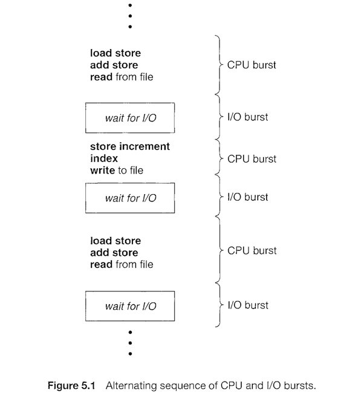

## [프로세스 관리 #1](https://core.ewha.ac.kr/publicview/C0101020140321144554159683?vmode=f)

### 프로세스 생성 (Process Creation)
Copy-on-write(COW) : write가 발생했을 때 copy한다, 그 전엔 그냥 공유

- 부모 프로세스(Parent process)가 자식 프로세스(children process)를 생성
- 프로세스의 트리(계층 구조)형성
- 프로세스는 자원을 필요로 함
    - 운영체제로부터 받는다
    - 부모와 공유한다
- 자원의 공유
    - 부모와 자식이 모든 자원을 공유하는 모델
    - 일부를 공유하는 모델
    - 전혀 공유하지 않는 모델
- 수행 (Execution)
    - 부모와 자식은 공존하며 수행되는 모델
    - 자식이 종료(terminate)될 때 까지 부모가 기다리는(wait)모델 

- 주소 공간 (Address space)
    - 자식은 부모의 공간을 복사함 (binary and OS data)
    - 자식은그 공간에 새로운 프로그램을 올림
- 유닉스의 예
    - fork() 시스템 콜이 새로운 프로세스를 생성 : 부모를 그대로 복사 (OS data except PID + binary)-> 주소공간 할당
    - fork 다음에 이어지는 exec() 시스템 콜을 통해 새로운 프로그램을 메모리에 올림

### 프로세스 종료 (Process Termination)

#### EXIT
- 프로세스가 마지막 명령을 수행한 후 운영체제에게 이를 알려줌
    - 자식이 부모에게 output data를 보냄 (via wait)
    - 프로세스의 각종 자원들이 운영체제에게 반납됨

#### ABORT
- 부모 프로세스가 자식의 수행을 종료시킴
    - 자식이 할당 자원의 한계치를 넘어섬
    - 자식에게 할당된 태스크가 더 이상 필요하지 않음
    - 부모가 종료(exit)하는 경우 : 운영체제는 부모 프로세스가 종료하는 경우 자식이 더이상 수행되도록 두지 않는다, 단계적인 종료

## [프로세스 관리 #2](https://core.ewha.ac.kr/publicview/C0101020140325134428879622?vmode=f)

### 프로세스와 관련한 시스템콜

### fork()
> "A process is created by the fork() system call." -> creates a new address space that is a duplicate of the caller.

Create a child(copy) 

### exec()
>"A process can execute a different program by the exec() system call. -> replaces the memory image of the caller with a new program.

Overlay new image

기존의 프로세스는 잊고 exec 다음에 나오느 프로세스로 덮어 씌움

exec() 이후의 코드는 실행안됨 (새로 덮어져서) 

### wait()

Sleep until child is done

- 프로세스 A가 wait()시스템 콜을 호출하면 
    - 커널은 child가 종료 될 때 까지 프로세스 A를 sleep시킨다(block상태)
    - Chiled process가 종료되면 커널은 프로세스 A를 깨운다(Red상태)

### exit()

Frees all the resources, notify parent

#### 프로세스의 종료
- 자발적 종료
  - 마지막 statement 수행 후 exit() 시스템 콜을 통해
  - 프로그램에서 명시적으로 적어주지 않아도 main 함수가 리턴되는 위치에 컴파일러가 넣어줌
  
- 비자발적 종료
  - 부모 프로세스가 자식 프로세스를 강제 종료시킴
    - 자식 프로세스가 한계치를 넘어서는 자원 요청
    - 자식에게 할당된 태스크가 더 이상 필요하지 않음
  - 키보드로 kill, break등을 친 경우
  - 부모가 종료하는 경우
    - 부모 프로세스가 종료하기 전에 자식들이 먼저 종료됨
   
### 프로세스 간 협력
- Independent process (독립적 프로세스)
  - 프로세스는 각자의 주소 공간을 가지고 수행되므로 원칙적으로 하나의 프로세스는 다른 프로세스의 수행에 영향을 치지 못 함

- Cooperating process (협력 프로세스)
  - 프로세스 협력 메커니즘을 통해 하나의 프로세스가 다른 프로세스의 수행에 영향을 미칠 수 있음

- IPC, interprocess communication (프로세스 간 협력 메커니즘)
  - 메세지를 전달하는 방버
    - messsage passing : 커널을 통해 메시지 전달
  - 주소 공간을 공유하는 방법
    - shared memory : 서로 다른 프로세스 간에도 일부 주소 공간을 공유하게 하는 shared memory 메커니즘이 있음
    - Thread : thread는 사실상 하나의 프로세스 이므로 프로세스 간 협력으로 보기는 어렵지만 동일한 process를 구성하는 thread 간에는 주소 공간을 공유하므로 협력이 가능

### Message Passing
운영체제 커널을 통해 통신하는데 방법의 차이가 있음

- Message system
  - 프로세스 사이에 Shared variable (공유 변수)를 일체 사용하지 않고 통신하는 시스템
  
- Direct Communication
  - 통신하려는 프로세스의 이름을 명시적으로 표시

- Indirect Communication
  - mailbox (또는 port)를 통해 메시지를 간접 전달

### Interprocess communication

- 

### CPU and I/O Bursts in Program Execution

>CPU Burst Time 이란 CPU 할당 후 입출력 요구 시까지의 시간을 뜻 함

### CPU-burst Time의 분포

- 여러 종류의 job(=process)가 섞여 있기 때문에 CPU 스케줄링이 필요하다
- interactive job 에게 적절한 response 제공 요망
- CPU와 I/O장치 등 시스템 자원을 골고루 효율적으로 사용

### 프로세스의 특성 분류
프로세스는 그 특성에 따라 다음 두 가지로 나눔
- I/O bound process
  - CPU를 잡고 계산하는 시간보다 I/O에 많은 시간이 필요한 job
  - many short CPU bursts
  
- CPU-bound process
  - 계산 위주의 job
  - few very long CPU bursts

### CPU Scheduler & Dispatcher

- CPU Scheduler
  - Ready 상태의 프로세스 중에서 이번에 CPU를 줄 프로세스를 고른다

- Dispatcher
  - CPU의 제어권을 CPU scheduler에 의해 선택된 프로세스에게 넘긴다
  - 이 과정을 context swtich라고 한다