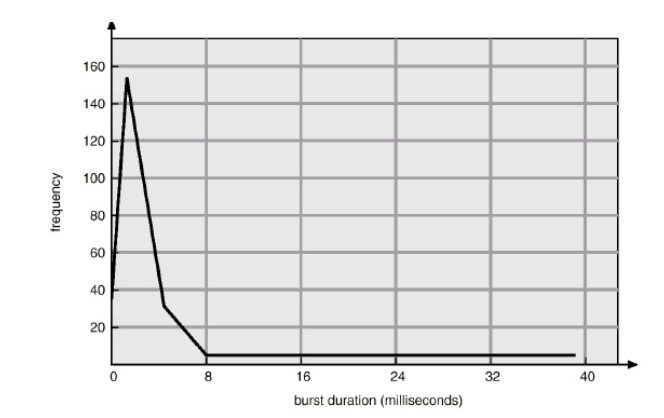
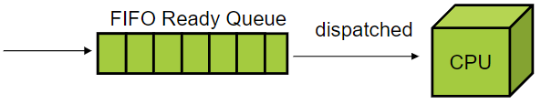
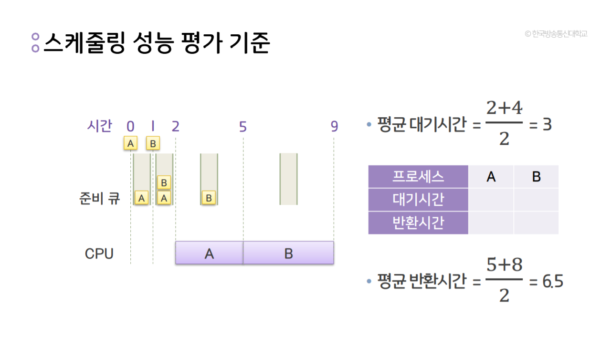
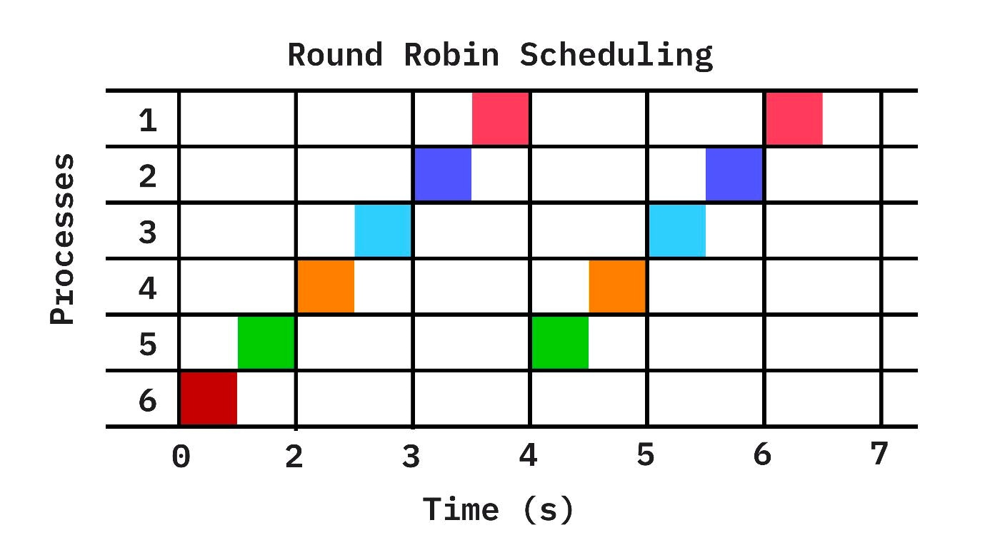
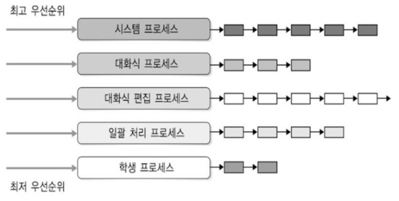
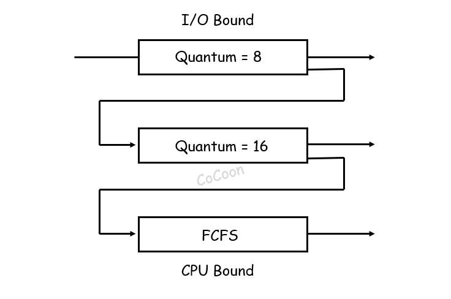

## [CPU 스케쥴링 #1](https://core.ewha.ac.kr/publicview/C0101020140328151311578473?vmode=f)

### CPU and I/O Bursts in Program Execution

- CPU를 연속적으로 쓸 수 있는 시간
- CPU burst가 짧다는 것은 중간에 I/O의 개입이 많다는 것
  

### CPU-burst Time의 분포

- 사용자와 상호작용 하는 프로세스가 보통 CPU burst가 짧음 
- 따라서 스케쥴링을 통해 burst가 짧은 프로그램에 더 자주 할당해야함

### 프로세스의 특성 분류

- CPU Bound : 프로세스 진행 속도가 CPU 속도에 의해 제한됨을 의미합니다. 작은 숫자를 곱하는 것과 같이 작은 숫자 집합에서 계산을 수행하는 작업은 CPU Bound 될 가능성이 높으며, I/O빈도가 낮고 CPU를 오래 사용하는 프로세스를 CPU Bound Job이라 합니다.

- I/O Bound : 프로세스가 진행되는 속도가 I/O 하위 시스템의 속도에 의해 제한됨을 의미합니다. 예를 들어, 파일의 행 수를 계산하는 등 디스크에서 데이터를 처리하는 작업은 I/O Bound 될 가능성이 높으며, I/O빈도가 많은 프로세스를 I/O Bound Job이라고 합니다.

- Memory Bound : 프로세스가 진행되는 속도가 사용 가능한 메모리 양과 해당 메모리 액세스 속도에 의해 제한됨을 의미합니다. 큰 행렬을 곱하는 것과 같이 많은 양의 메모리를 처리하는 작업은 Memory Bound 될 가능성이 높습니다. 

- Cache Bound : 프로세스 진행률이 사용 가능한 캐시의 양과 속도에 의해 제한되는 비율을 의미합니다. 캐시의 제한을 넘어서는 처리 작업은 Cache Bound 될 가능성이 높습니다.

### CPU Scheduler & Dispatcher

- 

### 스케쥴링 성능 척도
| 용어                | 설명                                                         |
|---------------------|--------------------------------------------------------------|
| CPU 사용률 (CPU Utilization) | CPU 활용 정도를 나타내는 비율                                |
| 처리율 (Throughput) | 단위 시간당 완료되는 프로세스의 수                           |
| 반환 시간 (Turnaround Time) | 프로세스가 생성되어 작업을 마치고 종료될 때까지의 걸리는 시간 |
| 대기 시간 (Waiting Time) | 프로세스가 생성되어 작업을 마치고 종료될 때까지 큐에서 기다리는 시간 |
| 반응 시간 (Response Time) | 대화형 시스템에서 임의 요구(예: 키보드 입력)에 대하여 시스템이 반응을 시작하는 데까지 걸리는 시간 |

- CPU utilization
  - keep the CPU as busy as possible
- Throughput
  - of process that 
- Turnaround time
  - amount of thime to execute a particular process
- Waiting time
  - amount of time a process has been waiting in the ready queue
- Response time
  - amount of time it takes from when a request was submitted untll the first response is produced, not output (for time-sharing environment)

효율성을 추구 -> CPU 사용률과 처리율을 최대화하고 반환,대기,반응 시간을 최소화하는 스케쥴러 선정

공평성을 추구 -> 각 기준에 있어서 최적의 평균갑소가 이들 간의 편차 최소화를 함께 고려하여 스케쥴러 선정

**시스템 용도에 따라 선정 기준이 달라질 수 있고 기준 간 Trade-off 가 있을 수 있음**

## [CPU 스케쥴링 #2](https://core.ewha.ac.kr/publicview/C0101020140401134252676046?vmode=f)

### 스케쥴링 알고리즘 (복수개)
> 운영체제는 CPU 스케줄링을 통해 Ready Queue에 있는 어떤 프로세스에 CPU를 할당할 것인지를 결정한다.

### Non-Preemtive 스케쥴링 
  일단 CPU가 한 프로세스에 할당되면, 그 프로세스가 종료 또는 I/O 처리를 위해 CPU를 방출할 때 까지 CPU를 점유한다. 

### Preemptive 스케쥴링
시분할 시스템에서 타임슬라이스가 소진되었거나, 인터럽트 혹은 시스템 호출 종료 시에 그 여파로 현 프로세스보다 높은 우선순위의 프로세스가 나타나는 경우, 현 프로세스로부터 강제로 CPU를 회수하는 것을 말합니다. 선점 스케줄링의 예로는 라운드로빈, 다단계 큐, 다단계 피드백 큐 스케줄링이 있습니다.

## FCFS , First-come First-Served Scheduling 

- CPU를 **먼저** 요청하는 프로세스가 CPU를 **먼저** 할당받는다. 
- 선입선출(FIFO) queue로 쉽게 관리할 수 있다. 
- Non-Preemtive

## SJF , Shortest Job First

- 각 프로세스의 next CPU burst 길이를 고려한 알고리즘
- CPU가 이용 가능해지면, 가장 작은 next CPU burst를 가진 프로세스에 CPU를 할당한다
- 두 프로세스가 동일한 길이의 next CPU burst를 가지면, FCFS를 적용한다.
- Non-Preemtive

#### 특징
1. 이론적으로 최소 평균 대기 시간을 제공
2. Starvation : 장시간 작업이 단시간 작업에 의해 계속해서 밀려날 경우, 오랜 시간 동안 CPU를 할당받지 못하는 기아 현상이 발생할 수 있습니다.
3. next CPU burst의 길이를 완벽하게 예측하기 어려움
4. SJF를 선점형으로 바꾼게 **SRT, shortest remaining time first** -> 남은 시간이 가장 적은게 최우선
   
## RR, Round Robing Scheduling

- 시간 할당량 또는 타임슬라이스라고 하는 작은 단위의 시간 동안 CPU를 사용하도록함
- CPU 스케쥴러는 준비 큐를 돌면서 한 프로세스에 한 번의 시간 할당량 동안 CPU를 할당한다

- Preemtive
  - cpu burst가 한 번의 시간 할당량을 초과하면, 프로세스는 선점되고 준비 큐로 되돌아간다.

#### 특징
1. time quantum(시간 할당량)의 크기에 매우 많은 영향을 받는다.
2. time quantum이 매우 크면 FCFC와 비슷해진다 (한 프로세스가 지나치게 오랫동안 CPU를 점유)
3. 반대로 너무 작으면 빈번한 context switching 으로 인해 오버헤드가 커진다.

*오버헤드 : 특정 기능을 수행하는데 드는 간접적인 시간, 메모리 등 자원을 뜻함

## Priority Scheduling, 우선순위 스케쥴링
- CPU는 가장 높은 우선순위를 가진 프로세스에 할당된다.
- 우선순위가 같은 프로세스들은 FCFS 순서로 스케줄 된다.
- 선점형과 비선점형 두가지 특성을 모두 가지고 있다
- (선점형 예) 새로 도착한 프로세스의 우선순위가 현재 실행되는 프로세스의 우선순위보다 높다면 context switching 발생
- (비선점형 예) 준비완료 큐에 새로운 프로세스를 넣는다.

#### 특징
1. Starvation : 낮은 우선순위의 프로세스들이 CPU를 무한히 대기하는 경우 발생 -> Aging 대응
2. Aging : 오래 대기하는 프로세스들의 우선순위를 점진적으로 증가시킨다

## MLQ , MultiLevel Queue Scheduling

- 우선순위마다 준비 큐 형성
- 항상 가장 높은 우선순위 큐의 프로세스에 CPU 할당
- 우선순위가 더 높은 상위단계 큐에 프로세스가 도착하면 진행중이던 프로세스(in 하위 큐)를 멈추고 CPU를 빼앗는 선점형 스케쥴링
- 각 큐는 RR,FCFS등 독자적 스케쥴링 가능

## MLFQ , MultiLevel Feedback Queue Scheduling

- 다단계 큐 + 동적인 프로세스 우선순위 변화 적용
- 프로세스 생성 시 가장 높은 우선순위 준비 큐에 등록되며 등록된 프로세스는 FCFS 순서로 CPU를 할당받아 실행된다. 해당 큐 CPU의 Time quantum이 끝나면 한 단계 아래의 준비 큐에 들어간다.
- 단계가 내려갈 수록 Time Quantum이 증가한다. 
- 큐 사이의 프로세스 이동이 가능(MLQ 불가능)하며 CPU Burst는 낮은 우선순위 큐에  I/O Burst는 높은 우선순위 큐에 배치한다.
  - 이유는 CPU 집중적인 프로세스는 CPU버스트가 길기 때문에 CPU를 오랜 시간 점유할 가능성이 높기 때문이다. 따라서 낮은 우선순위 큐에 넣어 다른 짧은 작업들이 빠르게 처리되고 난 뒤 CPU에 접근하도록 한다.

- 맨 하위 큐에서 너무 오래 대기하면 다시 상위 큐로 이동한다 -> Aging 
  
### 스케쥴링 알고리즘 평가 

-